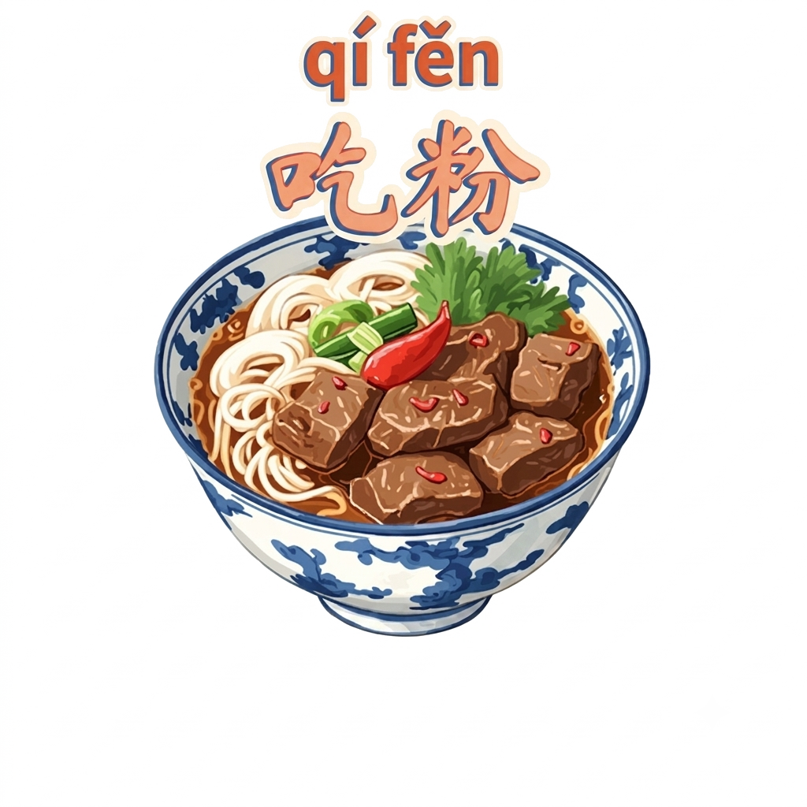

# changde-dialect-skill

**汉寿龙阳话，国家语言资源保护工程官方录音，带国际音标。** 给 AI agent 用的常德话 Skill，Claude Code / Codex / OpenClaw / Kimi Code CLI 都能装，四个平台的钩子全跑通过。

🌐 网页：https://dull-bird.github.io/changde-dialect-skill/

```
你：说常德话，你好
AI：好啵！我而今上线哒，你来哒就好。有么嘚事，尽管跟我讲。

你：好了，说普通话吧
AI：好的，已经切回普通话了！有什么可以帮你的？
```

## 这是什么

一个标准的 Agent Skills（`SKILL.md` + 参考文件）包，装进对应工具的 skills 目录后，说"说常德话"就会触发；说"说普通话"退出。**默认口音是汉寿龙阳话，数据来自中国语言资源保护工程（教育部、国家语委官方项目）汉寿调查点的真实录音，逐字带国际音标标注**——不是从网上东拼西凑的词表。仓库里另外整理了《常德方言词语汇1000》（水兵1986编，994词+151条桃源歇后语）当兜底，标题叫"常德方言"但实际偏桃源腔，只在汉寿数据没覆盖到、或你明确要其他片区口音时才用，详见"汉寿话专项数据"一节。

**四个工具各自都有一个关键词开关钩子**（不是靠模型自己猜），按 session 记录开关状态，说一次触发词就一直保持到你说退出为止——这些钩子的实现分别用了各工具原生的钩子机制，并且都经过真实调用测试确认生效（不是纸面设计）：

| 工具 | 钩子机制 | 验证方式 |
|---|---|---|
| Claude Code | `~/.claude/settings.json` 的 `UserPromptSubmit` hook（Python） | 手动 pipe 测试汉寿话/桃源腔两种模式开/关/切换/持久化/多会话隔离，8 个场景全过 |
| Codex | `~/.codex/config.toml` 的 `[[hooks.UserPromptSubmit]]`（同一个 Python 脚本） | `codex exec` 真实跑通，日志里能看到 `hook: UserPromptSubmit` |
| OpenClaw | `~/.openclaw/hooks/` 下的 `HOOK.md` + `handler.ts`（`message:received` + `agent:bootstrap` 两个事件） | `openclaw agent --local` 测试命令本身不走钩子链路（翻源码确认，`agent --local` 的处理逻辑不引用 hookRunner），但**真实飞书渠道发"说常德话"触发成功**：gateway 日志可见 `dispatching to agent`，状态文件按 session 正确落盘（`{"mode":"hanshou"}`） |
| Kimi Code CLI | `~/.kimi/config.toml` 的 `hooks = [{ event = "UserPromptSubmit", ... }]`（同一个 Python 脚本） | `kimi --print` 真实跑通，状态文件按 session 落盘确认 |

**两套口音互斥**：说"说常德话/说汉寿话/说龙阳话"进汉寿话模式，说"说桃源话"进桃源腔模式，两者不会同时生效，切换会整个替换而不是叠加——避免钩子的提醒文字里混进两套词汇。

桃源腔兜底词表（`glossary.md`，非默认口音）的分类：
- **词汇分类**：称谓/人称（120）、动植物名称（78）、农具生活用具（46）、身体部位（32）、时间方位（13）、民俗礼仪与丧葬文化（22）、骂人贬损粗语（24+）、桃源本地歇后语（151）、其余日常动词/程度词/俗语（约508）
- **语法核心**：了→哒，讲→港，去→克，看到→看斗，我→俺，很→几得，什么→么得，自己→各人……详见 `skills/changde-dialect/SKILL.md`

## 汉寿话（龙阳话）专项数据

**这是本项目的核心数据来源**：中国语言资源保护工程（教育部、国家语委官方项目）汉寿调查点（编号 26J41）的官方采录，真实发音人录音记的音，不是网上搜的二手资料。默认就用这套，不用先说"我是汉寿人"；水兵那份桃源腔底本只在这套没覆盖到、或你明确要其他片区口音时才用。

- `references/hanshou-ipa-vocab.md` —— 完整 1200 条词汇表，逐字带国际音标 + 赵元任调值标注。其中 0164/0172/0321 三条官方原始数据本身为空，不是抓取遗漏。
- `references/hanshou-ipa-sentences.md` —— 同一次采录的 50 句标准语法例句（把字句、被字句、疑问句等），普通话原句+汉寿话翻译+IPA。
- `references/hanshou-pinyin-vocab.md` —— 1200 词表自动转换出的近似拼音版，不熟悉国际音标的人用这份更好上手（原始 IPA 仍是权威版本）。
- `references/hanshou-accent.md` —— 汉寿口音的语音规则（n/l 不分、无翘舌音、fu/hu 合流、阴去阳平合流等）、汉寿县内 5 种口音分区说明、传统节日习俗实录、几篇可查证的学术论文摘要（人称代词读音、沧山话疑问代词等）。
- `scripts/dialect_lookup.py` —— 词典最大匹配查词脚本，给一句话返回里面哪些词在汉寿话词表里有对应说法，避免纯靠模型印象。
- `scripts/ipa_to_pinyin.py` —— 上面两份词表之间的转换脚本，配了 50+ 条单元测试。

## 安装

三种方式，前两种能装上技能 + 确定性开关钩子，第三种只装技能本身。

### ① 让 AI agent 自动装（技能 + 钩子）

把下面这段发给 Claude Code / Codex / OpenClaw / Kimi Code CLI：

```text
请帮我安装 changde-dialect 这个常德话 Agent Skill：
1. 克隆 https://github.com/dull-bird/changde-dialect-skill
2. 运行 ./install.sh，把 skills/changde-dialect 装到本机检测到的
   Claude Code / Codex / OpenClaw / Kimi Code CLI 的 skills 目录
3. 如果我用 Claude Code，运行 claude-code/install-hook.sh 注册关键词开关钩子
4. 如果我用 Codex，运行 codex/install-hook.sh（首次可能要批准 hook trust；
   非交互场景可以加 --dangerously-bypass-hook-trust，但这是 DANGEROUS 选项，
   装之前跟我确认一下）
5. 如果我用 OpenClaw，运行 openclaw/install-hook.sh
6. 如果我用 Kimi Code CLI，运行 kimi/install-hook.sh
7. 装完后跟我说"说常德话"确认效果，测试完再说"说普通话"退出
```

### ② 手动 clone + install.sh（技能 + 钩子）

```bash
git clone https://github.com/dull-bird/changde-dialect-skill.git
cd changde-dialect-skill
./install.sh                    # 自动探测 ~/.claude、~/.codex、~/.openclaw、~/.kimi，装好技能
./claude-code/install-hook.sh   # 可选：注册到 ~/.claude/settings.json
./codex/install-hook.sh         # 可选：注册到 ~/.codex/config.toml
./openclaw/install-hook.sh      # 可选：装到 ~/.openclaw/hooks/ 并 openclaw hooks enable
./kimi/install-hook.sh          # 可选：注册到 ~/.kimi/config.toml
```

技能安装位置：

| 工具 | 技能安装位置 |
|---|---|
| Claude Code | `~/.claude/skills/changde-dialect` |
| Codex | `~/.codex/skills/changde-dialect` |
| OpenClaw | `~/.openclaw/skills/changde-dialect`（全局，所有 agent 共用） |
| Kimi Code CLI | `~/.agents/skills/changde-dialect`（通用共享目录，Kimi 通过 `merge_all_available_skills` 读取） |

所有脚本都是幂等的，重复跑不会重复注册或破坏你已有的配置。

**Codex 用户注意**：hook 有个"hook trust"机制，交互式使用时首次可能需要批准；全自动/非交互场景可以加 `--dangerously-bypass-hook-trust`（官方标注 DANGEROUS，谨慎使用，仅在你信任 hook 来源时开）。

### ③ `npx skills` 一键装（仅技能，不含钩子）

实测 [skills.sh](https://skills.sh) 的通用安装器能正确识别并装好 `skills/changde-dialect`，自动适配 Claude Code / Codex / Cursor / OpenClaw 等 70 余个 agent：

```bash
npx skills add dull-bird/changde-dialect-skill
```

它只拷贝技能文件（复制/软链接到各工具的 skills 目录），**不会**帮你注册 `claude-code/`、`codex/`、`openclaw/`、`kimi/` 下的确定性开关钩子——想要钩子还是走①或②。没装钩子时，触发依然可以工作，只是退化成模型自己识别技能描述里的关键词，没有强制的按会话状态锁定。

### 手动安装

不想跑脚本的话，直接把 `skills/changde-dialect/` 拷到对应工具的 skills 目录，钩子部分参考 `claude-code/settings-snippet.json`、`codex/config-snippet.toml`、`openclaw/hooks/changde-dialect-toggle/`、`kimi/install_hook.py` 手动合并。

## 用法

| 说这句话 | 效果 |
|---|---|
| 说常德话 / 讲常德话 / 切换方言 / 开启方言模式 | 开启方言对话 |
| 退出方言 / 说普通话 / 切回普通话 / 关闭方言模式 | 恢复普通话 |
| "XX方言是什么意思" | 查词条，不用整段切方言 |

代码、命令、报错等技术性输出不会被方言化，只影响自然语言对话部分。骂人/粗语词条只用于轻度打趣或用户主动询问词义，不用来真正冒犯人。

## 目录结构

```
changde-dialect-skill/
├── install.sh                          # 一键装技能到检测到的所有工具
├── skills/changde-dialect/
│   ├── SKILL.md                        # 技能定义：语法、高频词表、使用边界、优先级
│   ├── references/
│   │   ├── glossary.md                 # 水兵桃源腔底本（994 条 + 151 条歇后语）
│   │   ├── hanshou-ipa-vocab.md        # 汉寿话官方 1200 词 IPA 表
│   │   ├── hanshou-pinyin-vocab.md     # 上面那份的近似拼音版
│   │   └── hanshou-accent.md           # 汉寿口音规则、分区、论文摘要
│   └── scripts/
│       ├── dialect_hook.py             # Claude Code / Codex / Kimi 共用的开关钩子脚本
│       ├── dialect_lookup.py           # 词典最大匹配查词（+ test_dialect_lookup.py）
│       └── ipa_to_pinyin.py            # IPA→近似拼音转换（+ test_ipa_to_pinyin.py）
├── claude-code/
│   ├── install-hook.sh / install_hook.py
│   └── settings-snippet.json
├── codex/
│   ├── install-hook.sh / install_hook.py
│   └── config-snippet.toml
├── kimi/
│   ├── install-hook.sh / install_hook.py
└── openclaw/
    ├── install-hook.sh
    └── hooks/changde-dialect-toggle/
        ├── HOOK.md
        └── handler.ts                  # message:received 记状态，agent:bootstrap 注入提醒
```

## 为什么四个工具能共用一份 SKILL.md，钩子却大半能共用、只有一个要分开写

Claude Code、Codex、OpenClaw、Kimi Code CLI 都支持同一种 Agent Skills 约定（`name` + `description` frontmatter 的 `SKILL.md`，模型根据 `description` 里的触发词自行判断何时调用），所以一份 skill 四边通用。

**钩子这边意外地统一**：Claude Code、Codex、Kimi Code CLI 三家的 `UserPromptSubmit` 事件名和 JSON stdin/stdout 契约几乎一致（`session_id`/`prompt` 进，`hookSpecificOutput.additionalContext` 出），所以三家共用同一份 `dialect_hook.py`，只是注册方式不同——Codex 写进 `config.toml` 的 `[[hooks.UserPromptSubmit]]` 数组，Kimi 写进 `config.toml` 的 `hooks = [...]` 扁平数组。只有 **OpenClaw** 的 hook 是 TypeScript/Node 写的，事件模型也不同（没有直接对应"用户提交消息"的事件，而是 `message:received`——记录状态——配合 `agent:bootstrap`——注入 bootstrap 内容里），所以单独写了一份 `handler.ts`，用的是 OpenClaw 真实的内部类型定义（`AgentBootstrapHookContext.bootstrapFiles`、`MessageReceivedHookContext.content`），照着它自带的 `bootstrap-extra-files` 内置钩子源码抄的模式。

## 致谢与出处

方言词汇内容整理自水兵1986发布于美篇的[《常德方言词语汇1000》](https://www.meipian.cn/m5r5mum)，原作者在文末注明"欢迎修订补充完善"。本仓库据此邀请重新整理、结构化并附上分类和用法说明。如果你是原作者或对内容使用有疑问，欢迎提 issue。

欢迎补充词条、修正释义、纠正分类，或者给这四个工具之外的其它 agent 框架补上等价的钩子。

## License

MIT，词表内容附带来源声明，见 [LICENSE](LICENSE)。
